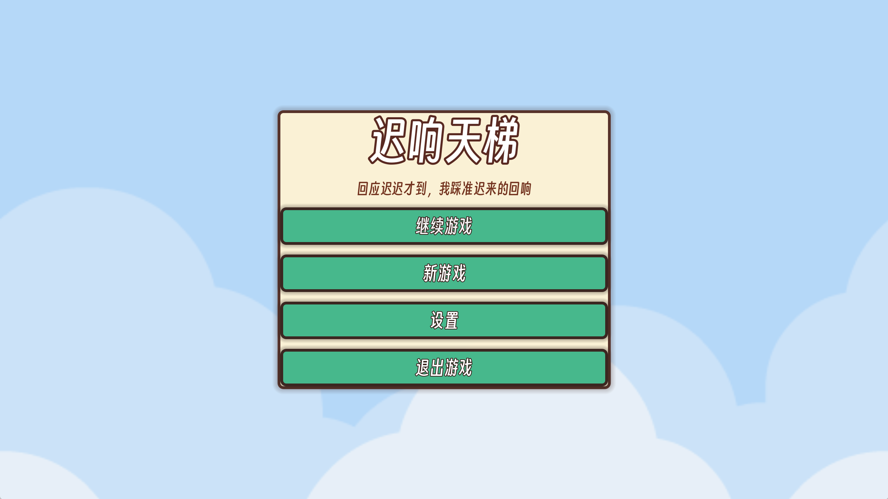
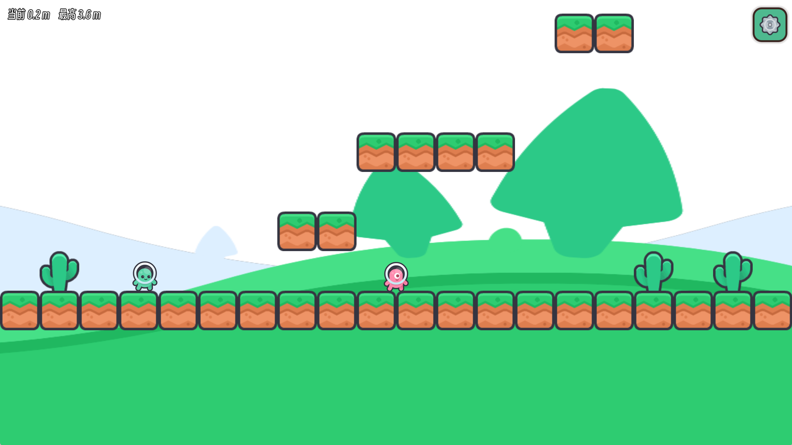
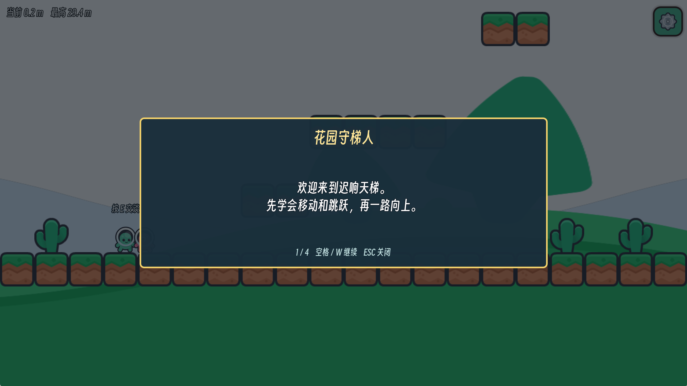
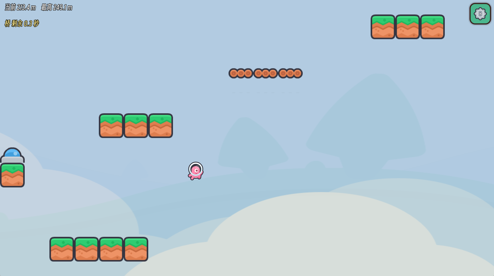
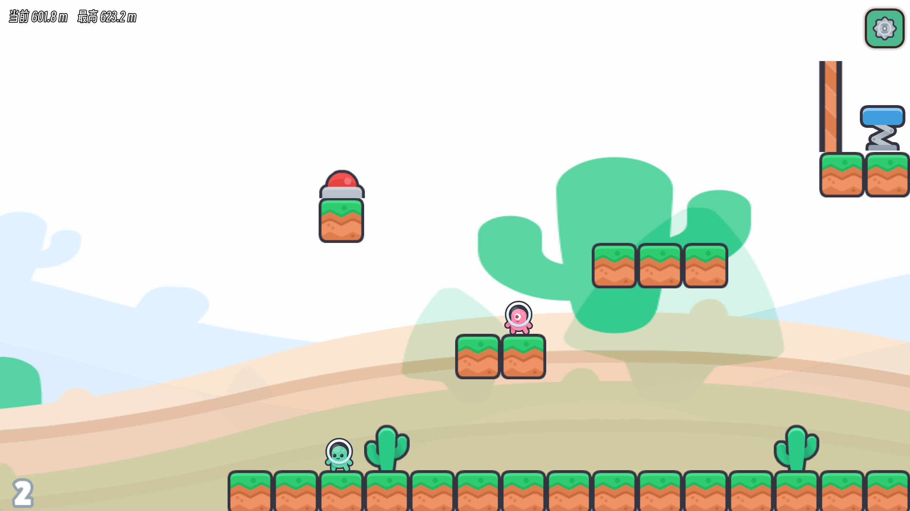
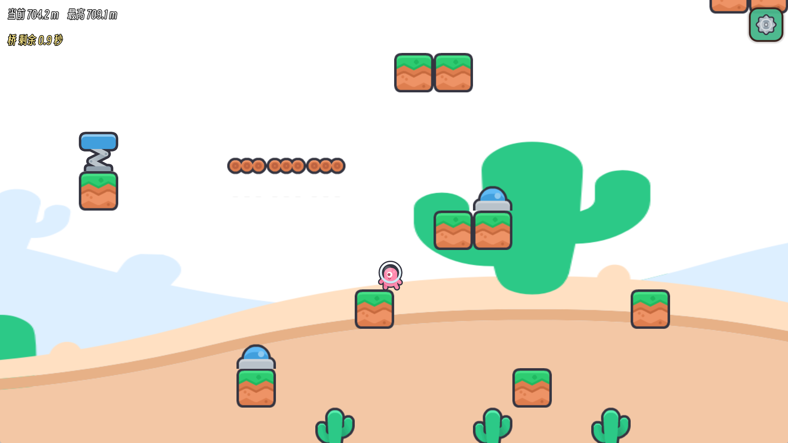
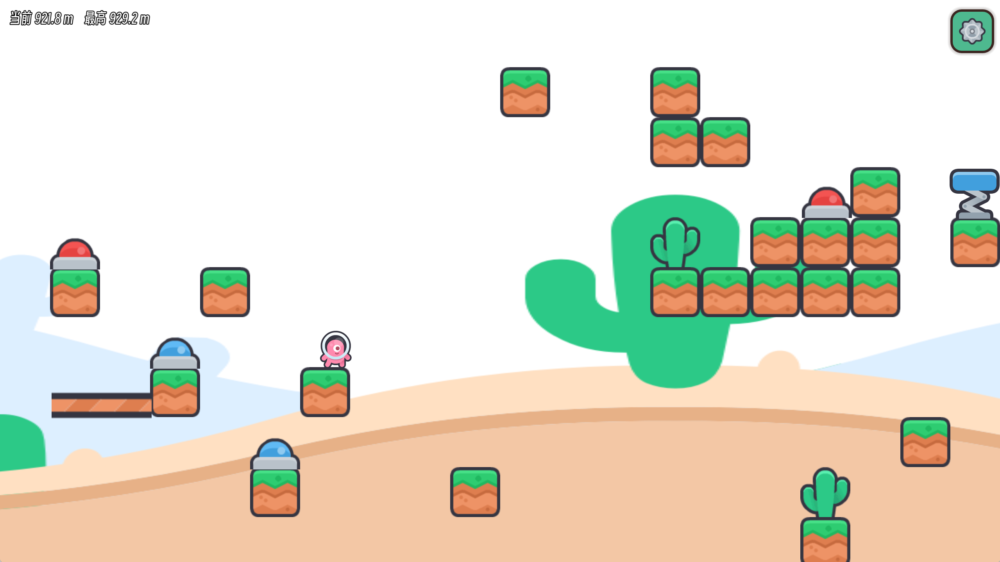

<p align="center">
  
</p>

<h1 align="center">迟响天梯 / Echoes Rising</h1>

<p align="center">
  一款以“延迟回响”为主题的纵向平台跳跃游戏。
</p>

<p align="center">
  
  
  
  
</p>



## 项目简介

《迟响天梯》是 Godot 游戏创作节 2026 的参赛作品。

世界不会立刻回应玩家的行动。按下按钮后，平台、弹簧、门和通道会延迟出现或消失；玩家必须在回应到来之前提前判断，踩着迟来的变化一路向上。游戏没有血量和死亡，失误只会让人掉回下方，重新寻找路线继续攀登。

作品想表达的是：认真走过的每一步都不会白费。回响可能迟到，但继续向上的人，最终能够亲手接住它。

## 游戏截图

| 开始攀登 | NPC 教学 |
| --- | --- |
|  |  |

| 延迟平台 | 弹簧路线 |
| --- | --- |
|  |  |

| 红门机关 | 最终挑战 |
| --- | --- |
|  |  |

## 核心玩法

- 纵向攀登式平台跳跃，目标一直是向上。
- 没有血量、战斗和死亡，失败代价是掉回下方。
- 蓝色按钮延迟生成平台、桥梁或弹簧。
- 红色按钮延迟移除门、通道或地面，并在之后恢复。
- 机关响应期间不能重复刷新计时，玩家需要看清节奏并安排下一步。
- 最终阶段会组合已经学过的机关，要求更准确的落点和时机。

## 主要功能

- 中文和英文界面、教程与 NPC 对话
- 当前高度、历史最高高度和机关倒计时 HUD
- 退出时保存当前位置，可从主菜单继续
- 新游戏、继续游戏、设置和暂停菜单
- 音乐、音效、全屏和分辨率设置
- 可复用的弹簧、按钮和延迟平台独立场景
- 所有需要策划调整的 Inspector 属性均带中文说明

## 操作

| 操作 | 键盘 |
| --- | --- |
| 左右移动 | `A` / `D` 或 `←` / `→` |
| 跳跃 | `W`、`↑` 或 `Space` |
| 与 NPC 交谈 | `E` |
| 暂停 | `Esc` |

当前正式导出和测试范围是 Windows x86_64 键盘操作。手柄输入映射存在于工程中，但尚未完成玩家侧键位提示和正式验证，因此不对外声明为已支持。

## 技术信息

| 项目 | 信息 |
| --- | --- |
| 引擎 | Godot 4.7.1 |
| 脚本 | GDScript |
| 渲染器 | Compatibility |
| 游戏类型 | 平台跳跃、益智解谜、动作 |
| 目标平台 | Windows x86_64 |
| 默认语言 | 中文 |
| 本地化 | 中文、English |

## 运行项目

1. 使用 Godot `4.7.1` 打开项目根目录。
2. 等待资源导入完成。
3. 运行主场景：

```text
res://scenes/ui/main_menu.tscn
```

Windows 导出预设位于 `export_presets.cfg`，默认导出文件名为 `EchoesRising.exe`。构建产物会输出到 `OutPut/`，该目录不提交到 Git。

## 项目结构

```text
assets/        美术、音频、字体和项目图标
docs/          策划、开发、本地化、素材与项目文档
localization/  英文翻译资源
resources/     TileSet、UI 主题和 NPC 对话库
scenes/        玩家、关卡、机关和 UI 场景
scripts/       GDScript 游戏逻辑
```

## 项目文档

- [策划方向](docs/策划方向_v2.md)
- [开发路线图](docs/开发路线图_v2.md)
- [按钮颜色约定](docs/按钮颜色约定.md)
- [NPC 教程文案](docs/教程文案.md)
- [本地化指南](docs/本地化指南.md)
- [素材与许可证](docs/CREDITS.md)

## 第三方素材

- Kenney New Platformer Pack
- Zane Little Music，Flowerbed Fields 与 Pixel Sprinter
- 得意黑 Smiley Sans

完整来源和许可证见 [docs/CREDITS.md](docs/CREDITS.md)。
